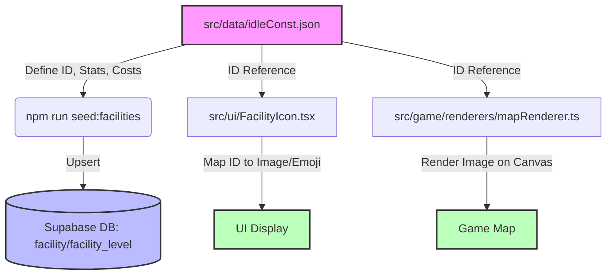
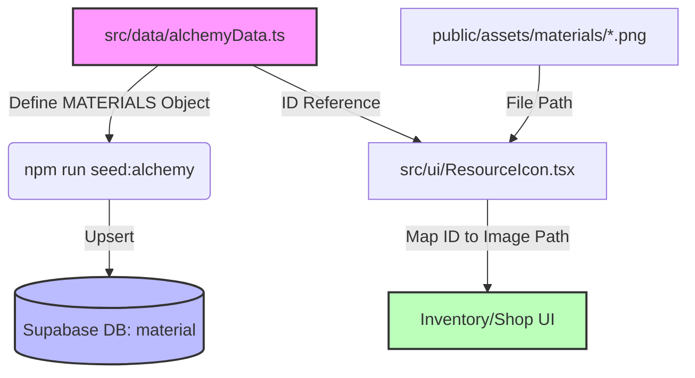
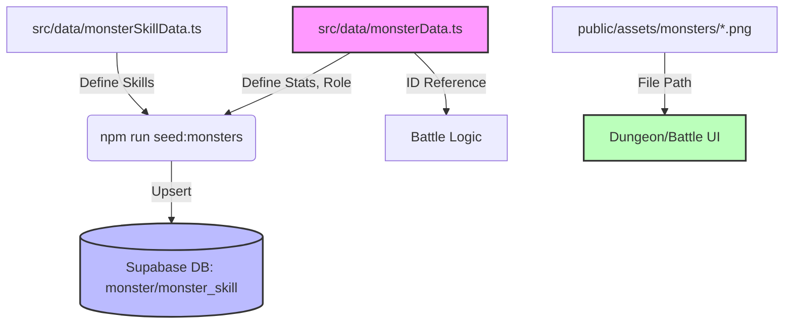
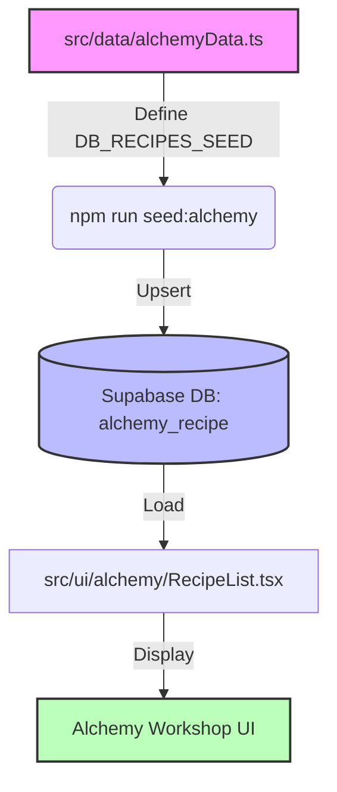

# 🔄 Data Flow & Dependency Rules

This document visualize the flow of data from definition to UI rendering. Use this to ensure no steps are missed when adding new content.

## 🏗️ Facility Flow
When adding a new facility (`@/facility`), the data flows as follows:

**Checklist:**
1. Defined in JSON?
2. DB Seeded?
3. Icon Mapped?
4. Map Renderer Updated?

---

## 🧪 Material Flow
When adding a new material (`@/material`):

**Checklist:**
1. Defined in TS?
2. DB Seeded?
3. Image Exists?
4. Icon Mapped (Crucial)?

---

## 👹 Monster Flow
When adding a new monster (`@/monster`):

**Checklist:**
1. Data Defined?
2. Skills Defined?
3. DB Seeded?
4. Image Exists?

---

## 📜 Recipe Flow
When adding a new recipe (`@/recipe`):

**Checklist:**
1. Recipe Defined?
2. Inputs/Outputs Valid?
3. DB Seeded?
