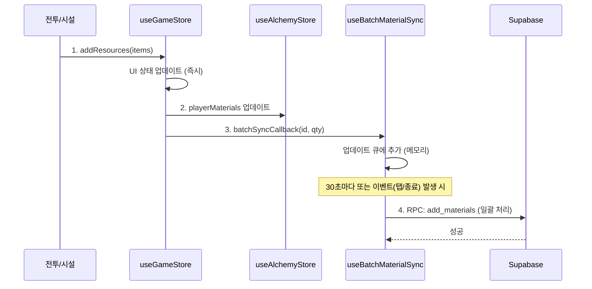
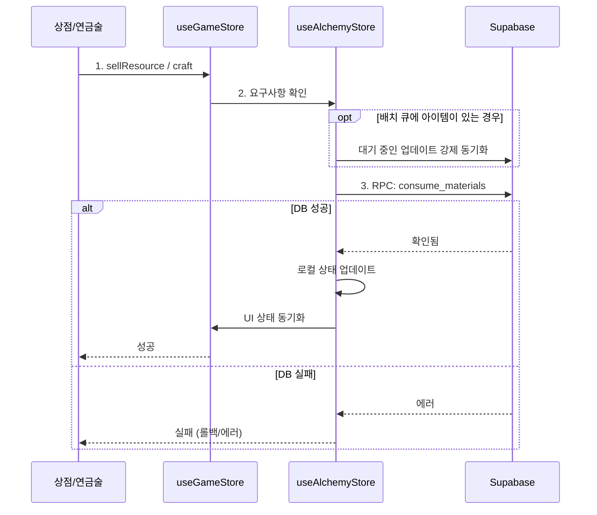

# 자원 처리 흐름 문서 (Resource Processing Flow)

이 문서는 젬틀몬스터(GemtleMonster)의 자원 관리 아키텍처와 흐름을 설명합니다. 특히 자원 획득, 상태 관리, 그리고 데이터베이스 동기화 방식에 초점을 맞춥니다.

## 1. 아키텍처 개요 (Architecture Overview)

이 게임은 UI/게임플레이 관심사와 데이터 영속성을 분리하기 위해 **이중 스토어 아키텍처(Dual Store Architecture)**를 사용합니다.

### 스토어 (Stores)
1.  **`useGameStore` (UI & 게임플레이)**
    *   **목적**: 즉각적인 게임플레이 피드백, UI 애니메이션, 임시 상태를 관리합니다.
    *   **역할**:
        *   UI 카운터를 즉시 업데이트합니다.
        *   "최근 획득(Recent Addition)" 팝업 및 애니메이션을 처리합니다.
        *   전투 상태 및 시설 생산 타이머를 관리합니다.
    *   **주요 데이터**: `resources` (Record<string, number>), `recentAdditions`.

2.  **`useAlchemyStore` (데이터 & 영속성)**
    *   **목적**: 플레이어 데이터의 단일 진실 공급원(Single Source of Truth) 역할을 하며 DB 동기화를 담당합니다.
    *   **역할**:
        *   공식적인 `playerMaterials` 상태를 유지합니다.
        *   `alchemyApi` (Supabase)와 통신합니다.
        *   배치 동기화(Batch Synchronization) 큐를 관리합니다.
    *   **주요 데이터**: `playerMaterials`, `userId`.

---

## 2. 자원 흐름도 (Resource Flow Diagrams)

### A. 자원 획득 (전투, 시설)
*게임플레이 중 획득한 자원은 DB 부하를 줄이기 위해 큐에 쌓인 후 일괄(Batch) 동기화됩니다.*

### B. 자원 소비 (연금술, 상점)
*자원 소비는 엄격한 검증이 필요하므로 보통 즉시 동기화하거나 DB와 대조합니다.*

---

## 3. 동기화 메커니즘 (Synchronization Mechanism)

빠른 이벤트(자동 전투, 방치형 생산 등)로 인한 과도한 DB 호출을 방지하기 위해 **배치 동기화 시스템**을 사용합니다.

### 주요 컴포넌트

1.  **`useBatchMaterialSync` Hook**
    *   `pendingUpdates` 큐(ref)를 유지 관리합니다.
    *   **`queueUpdate(id, qty)`**: 변경사항을 큐에 추가합니다.
    *   **`syncToDatabase()`**: `add_materials` RPC를 사용하여 큐의 내용을 DB에 저장합니다.
    *   **트리거(Triggers)**:
        *   인터벌: 30초마다.
        *   `onBeforeUnload`: 브라우저 종료/새로고침 시.
        *   `onVisibilityChange`: 탭 전환 시.

2.  **스토어 통합 (Store Integration)**
    *   `UIOverlay.tsx`가 `useBatchMaterialSync`를 초기화하고 콜백(`setBatchSyncCallback`)을 `useAlchemyStore`에 등록합니다.
    *   `useGameStore`는 `useAlchemyStore.getState().batchSyncCallback`을 통해 이 콜백에 접근합니다.

---

## 4. 주요 함수 및 사용법 (Key Functions & Usage)

### 자원 추가 (Adding Resources)
**함수**: `useGameStore.getState().addResources(rewards, source)`

*   **사용처**: 플레이어가 아이템을 획득할 때 (전투 승리, 시설 클릭).
*   **동작**:
    1.  `gameStore.resources` (UI) 업데이트.
    2.  시각적 팝업 표시.
    3.  `alchemyStore.playerMaterials` 업데이트.
    4.  배치 시스템을 통해 **DB 업데이트 큐에 추가**.

### 자원 판매/소비 (Selling/Consuming Resources)
**함수**: `useGameStore.getState().sellResource` 또는 `alchemyStore.completeBrewing`

*   **사용처**: 아이템이 제거될 때 (상점 판매, 제작).
*   **동작**:
    1.  로컬 보유량 확인.
    2.  **강제 동기화(Force Sync)**: `forceSyncCallback`을 호출하여 대기 중인 배치 추가사항을 먼저 저장.
    3.  **DB 트랜잭션**: `alchemyApi.consumeMaterials` 호출 (즉시 DB 쓰기).
    4.  성공 시 로컬 상태 업데이트.

---

## 5. 향후 개발 가이드라인 (Future Development Guidelines)

자원 관련 기능을 추가할 때 다음 사항을 준수하세요:

1.  **아이템 획득 시**:
    *   항상 `useGameStore.getState().addResources()`를 사용하세요.
    *   게임 루프를 우회하는 특수한 경우가 아니라면 `alchemyApi.addMaterial`을 수동으로 호출하지 마세요.

2.  **아이템 사용 시**:
    *   DB 소비의 **비동기(Async)** 특성을 반드시 처리하세요.
    *   중요한 트랜잭션 전에는 항상 `forceSyncCallback`을 확인하여 최근 획득한 아이템이 DB에 반영되었는지 확인하세요.

3.  **새로운 스토어/인벤토리**:
    *   새로운 유형의 아이템을 추가할 경우, `AlchemyStore`의 `playerMaterials`나 유사한 동기화 구조에 포함되도록 하세요.
